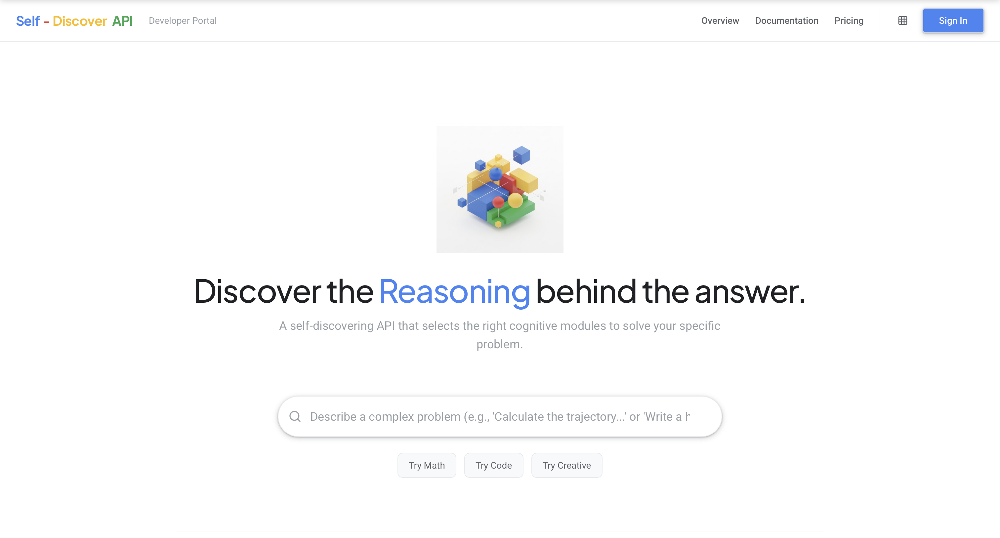
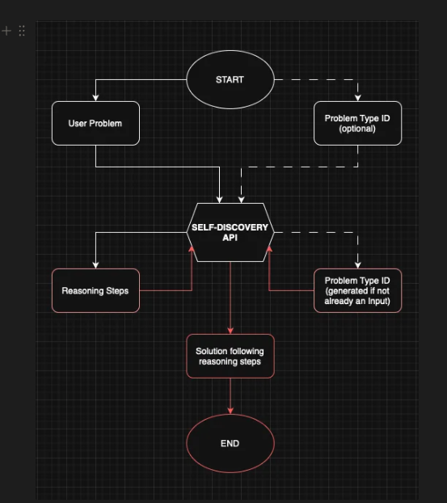

# Productize SELF-DISCOVER

A working implementation of Google DeepMind's [SELF-DISCOVER](https://arxiv.org/pdf/2402.03620) reasoning framework, productized as an API with a developer playground.

Instead of using one-size-fits-all prompting, the model first analyzes your problem type and builds a custom reasoning structure. That structure is then reused to solve any problem of the same type — faster and more accurately.



## How It Works

**Stage 1 — Discovery** (runs once per problem type)

```
Your task description
        ↓
   [ SELECT ] → Pick relevant reasoning modules from a library of 39
        ↓
   [ ADAPT ]  → Tailor each module to your specific problem type
        ↓
   [IMPLEMENT] → Compose into a step-by-step JSON reasoning plan
        ↓
   Saved structure + ID
```

**Stage 2 — Inference** (runs per problem, using the saved structure)

```
Structure ID + specific problem
        ↓
    [ SOLVE ] → Follow the reasoning plan step-by-step
        ↓
    Answer + full reasoning trace
```

The paper showed up to 32% accuracy improvement over Chain-of-Thought and 10-40x compute reduction versus ensemble methods like CoT-Self-Consistency.

## Tech Stack

- **Backend:** Python + FastAPI + aiosqlite
- **Frontend:** HTML/CSS/JS (Google-inspired design, no framework)
- **LLM:** Google Gemini 2.5 Pro (with extended thinking)
- **Database:** SQLite

## Quick Start

```bash
# Clone
git clone https://github.com/agnsn25/Productize_SELF-DISCOVERY.git
cd Productize_SELF-DISCOVERY

# Setup
python -m venv .venv
source .venv/bin/activate
pip install -r backend/requirements.txt

# Configure
cp backend/.env.example backend/.env
# Edit backend/.env and add your GEMINI_API_KEY

# Run
uvicorn backend.app.main:app --reload --port 8001
```

Open `http://localhost:8001` for the playground, or `http://localhost:8001/docs` for API documentation.

## API Endpoints

| Method | Endpoint | Description |
|--------|----------|-------------|
| `POST` | `/api/discover` | Run discovery pipeline for a task type |
| `POST` | `/api/infer` | Solve a problem using a saved structure |
| `POST` | `/api/infer/compare` | Compare naive vs SELF-DISCOVER side-by-side |
| `GET` | `/api/structures` | List all saved reasoning structures |
| `GET` | `/api/structures/{id}` | Get full details of a structure |

## Example

**Discover** a reasoning structure:
```bash
curl -X POST http://localhost:8001/api/discover \
  -H "Content-Type: application/json" \
  -d '{"task_description": "Solve multi-step math word problems involving rates, percentages, and unit conversions"}'
```

**Solve** a problem with it:
```bash
curl -X POST http://localhost:8001/api/infer \
  -H "Content-Type: application/json" \
  -d '{"structure_id": "YOUR_ID", "problem": "A store offers 20% off a $150 jacket, then 15% member discount. Tax is 8.5%. Final price?"}'
```

## Project Structure

```
├── backend/
│   ├── app/
│   │   ├── main.py              # FastAPI app, routes, page serving
│   │   ├── discovery.py         # SELECT → ADAPT → IMPLEMENT pipeline
│   │   ├── inference.py         # SOLVE + naive comparison
│   │   ├── gemini_client.py     # Gemini 2.5 Pro client (lazy-init)
│   │   ├── reasoning_modules.py # 39 cognitive reasoning modules
│   │   ├── prompts.py           # All LLM prompt templates
│   │   ├── database.py          # SQLite via aiosqlite
│   │   ├── models.py            # Pydantic request/response models
│   │   └── routes/              # API route handlers
│   └── requirements.txt
├── frontend/
│   ├── index.html               # Developer playground
│   ├── docs.html                # Documentation page
│   ├── style.css                # Main stylesheet
│   ├── docs.css                 # Docs-specific styles
│   └── app.js                   # Frontend logic
├── tests/                       # 27 tests (database, discovery, inference)
├── specs/                       # PRD, thesis, architecture, implementation plan
└── FORADHARSH.md                # Project walkthrough and lessons learned
```

## Tests

```bash
python -m pytest tests/ -v
```

## Docs

- [Product Requirements Document](specs/prd.md)
- [Core Thesis](specs/thesis.md)
- [Architecture Diagram](specs/architectureDiagram.md)
- [Implementation Plan](specs/phasedImplementation.md)
- [Decisions Log](specs/decisions.md)
- [Original Paper (PDF)](https://arxiv.org/pdf/2402.03620)


